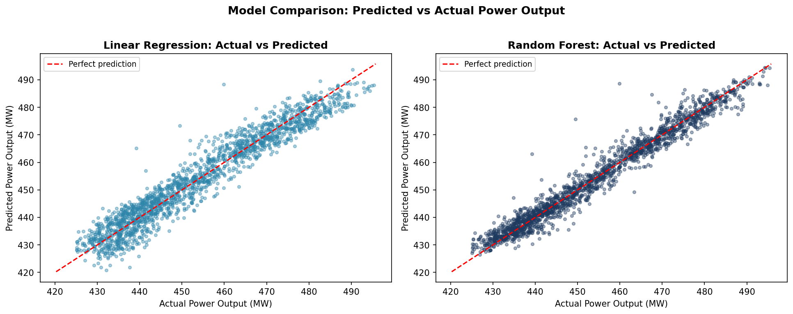
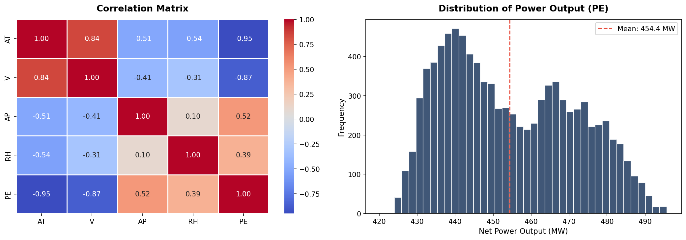
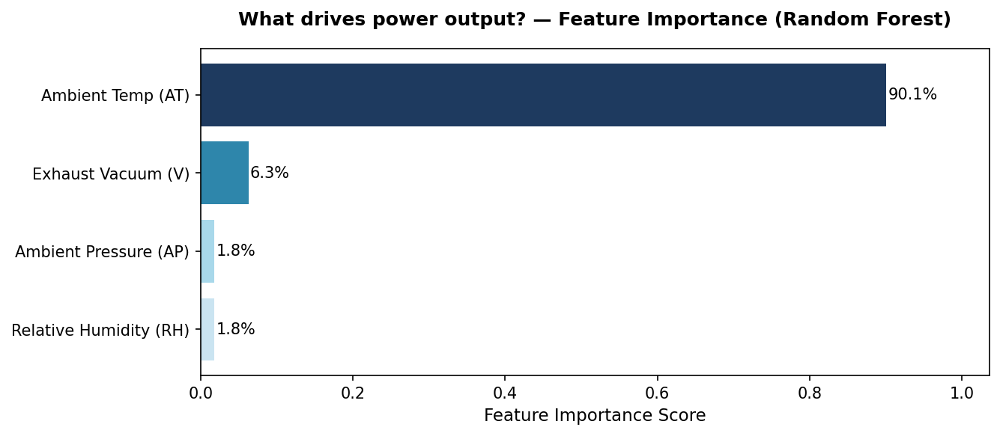

# Energy Output Prediction — An AI Product Management Case Study

> This project demonstrates how a Product Manager evaluates competing ML models for an operational business decision — not just to optimize for accuracy.

**[▶ Watch the full project presentation (<5 min)](https://youtu.be/KCz7heIsqik)**

---

## Executive Snapshot

| | |
|---|---|
| **Business Problem** | Improve energy dispatch planning through accurate power output prediction |
| **Models Evaluated** | Linear Regression (baseline) and Random Forest Regressor |
| **Best Result** | Random Forest achieved R² = 0.964 and RMSE = 3.24 MW |
| **Product Recommendation** | Deploy Random Forest for operational forecasting while maintaining Linear Regression as an interpretable benchmark |
| **Key PM Insight** | The best-performing model is not always the easiest one to adopt — stakeholder trust and explainability are critical for operational AI systems |
| **Critical Finding** | Ambient Temperature alone drives 90.1% of predicted output — a useful simplification for forecasting, and a flag for production validation |
| **Production Considerations** | Model monitoring, drift detection, explainability, retraining strategy, and integration into operator workflows are required before deployment |

---

## The PM Questions Behind This Project

Beyond the numbers, this project is structured around five questions a Product Manager should be able to answer about any ML system before recommending it for production.

- How accurate does a prediction need to be before it becomes operationally useful?
- When should a team prioritize model performance over interpretability?
- How should Product Managers evaluate ML models beyond technical metrics?
- What risks must be addressed before moving an AI solution into production?
- How can trust be built among operators who rely on AI-generated predictions?

---

## About This Project

Built as part of Duke University's **AI Product Management Specialization**, this project applies a PM lens to a real ML regression problem: predicting the hourly power output of a Combined Cycle Power Plant based on environmental conditions.

The goal is not to build the best model — it's to answer the question a Product Manager actually faces: *which model should we ship, and why?*

This repository documents the full evaluation: business context, model trade-offs, success metrics, risks, and what a production-ready version would look like.

---

## Business Context

Combined Cycle Power Plants (CCPP) generate electricity by combining a gas turbine with a steam turbine. Their output is directly affected by ambient conditions — temperature, pressure, humidity, and exhaust vacuum — which fluctuate constantly.

**Why does prediction matter?**
- Energy output uncertainty creates planning and dispatch challenges for grid operators.
- Overestimating output leads to supply shortages; underestimating leads to wasted capacity and cost.
- A reliable predictive model reduces operational uncertainty and enables better energy dispatch decisions.

**Who would use this model?**
- **Grid operators** — to anticipate available capacity and plan dispatch schedules.
- **Plant managers** — to benchmark actual vs. predicted output and flag anomalies.
- **Commercial teams** — to inform energy trading decisions based on forecasted output.

**What business decision could this improve?**
A model with RMSE ~3.24 MW and R² of 0.964 provides enough precision to support hourly dispatch planning, reducing reliance on conservative manual estimates.

---

## Product Objective

Reduce operational uncertainty in energy dispatch planning by providing a reliable hourly prediction of power plant output — accurate enough to inform real decisions, interpretable enough to build operator trust.

**Scope of this case study:**
- Evaluate two ML models (Linear Regression vs. Random Forest) for this use case.
- Define success metrics from a product perspective, not just statistical ones.
- Document trade-offs and the reasoning behind the recommended model.
- Identify risks and what would be needed before production deployment.

---

## Dataset

- **9,568** hourly records collected over 6 years from a real CCPP.
- Each record includes four environmental conditions and actual power output.
- Source: [Machine Learning Repository – CCPP Dataset](https://storage.googleapis.com/aipi_datasets/CCPP_data.csv)

**Input features:**

| Variable | Description |
|----------|-------------|
| `AT` | Ambient Temperature (°C) |
| `V` | Exhaust Vacuum (cm Hg) |
| `AP` | Ambient Pressure (millibar) |
| `RH` | Relative Humidity (%) |

**Target:** `PE` — Net hourly electrical power output (MW)

> **Note:** The data file in this repository is `CCPP_data.csv` (uppercase). The notebook loads `ccpp_data.csv` (lowercase), which works on case-insensitive systems (macOS, Windows) but will fail on Linux. If running on Linux, rename the file before running: `mv data/CCPP_data.csv data/ccpp_data.csv`

---

## Models Used

Two machine learning models were implemented and evaluated:

- **Linear Regression** — selected as a simple and interpretable baseline.
- **Random Forest Regressor** — used to capture non-linear relationships and feature interactions.

---

## Success Metrics

| Metric | Linear Regression | Random Forest | Assessment |
|--------|------------------|---------------|------------|
| RMSE (MW) | 4.50 | **3.24** | ~0.7% error on avg output (~460 MW) |
| R² Score | 0.930 | **0.964** | RF explains 96.4% of output variance |
| CV RMSE | 4.57 ± 0.08 | **3.46 ± 0.15** | Both models generalize well |
| CV MSE | 20.91 ± 0.74 | **12.01 ± 1.03** | RF consistently lower across folds |

**From a product perspective:**
- An RMSE of 3.24 MW means the model's prediction is within ~3.24 MW of actual output on average. For dispatch planning at this scale, that precision is operationally useful.
- The Random Forest R² of 0.964 means only ~3.6% of output variance is unexplained — a strong signal for a model with just 4 input features.
- The baseline (Linear Regression) is already good enough for low-stakes planning; Random Forest earns its complexity in high-stakes dispatch scenarios.

---

## Model Trade-offs

### Linear Regression — the interpretable baseline

- **Strengths:** Fully explainable. An operator can understand *why* the model predicts a given output. Easier to audit, debug, and trust in regulated environments.
- **Weaknesses:** Assumes linear relationships between variables — not realistic for a thermal process where interactions (e.g., temperature × humidity) matter.
- **Best fit for:** Internal stakeholder presentations, regulatory contexts, or teams where model explainability is a hard requirement.

### Random Forest — the performant choice

- **Strengths:** Captures non-linear relationships and feature interactions. 30% lower RMSE than Linear Regression. More robust to outliers.
- **Weaknesses:** Black-box by default. Harder to explain to non-technical users. Larger model footprint; requires more monitoring.
- **Best fit for:** Production systems where accuracy directly drives business value and interpretability can be addressed via feature importance and dashboards.

### Recommended decision

**Ship Random Forest for operational predictions. Maintain Linear Regression as the interpretable audit layer.**

This mirrors a common product pattern: use the performant model for automated decisions, keep the interpretable one for stakeholder explainability and trust-building.

> Having worked in the energy sector, I've seen firsthand that operator trust is often the real adoption blocker — not model accuracy. A 30% RMSE improvement means nothing if dispatchers don't trust the output.

---

## Product Management Takeaways

Working through this project as a PM — not as a data scientist — clarified a few things I now apply in my actual product work:

**1. The metric isn't the goal — the decision is.**
RMSE of 3.24 is meaningless without knowing the cost of a 3 MW prediction error. Before choosing a model, a PM needs to answer: *what happens if the model is wrong, and how wrong is too wrong?* That's a business question, not a statistical one.

**2. Interpretability is a product requirement, not a nice-to-have.**
At UTE, I saw firsthand that operators won't act on a system they don't understand. Random Forest outperforms Linear Regression on every metric — but without a feature importance view and confidence intervals, it may never get adopted.

**3. Cross-validation matters more than test score for production conversations.**
A model that scores well on one test set might be overfit. The CV RMSE (3.46 ± 0.15) tells you the model generalizes — that's the number to bring to a production review.

**4. Extreme feature dominance is both an insight and a risk signal.**
Ambient Temperature drove 90.1% of the Random Forest's predictive importance — far beyond what thermodynamic theory would predict as its isolated contribution. While operationally convenient (temperature forecasts are widely available), a model that has effectively learned to ignore three of its four inputs may be fragile under distributional shift or sensor failure. This warrants collinearity analysis before production deployment.

**5. Questions a PM should ask before any model goes to production:**
- What's the cost of a false positive vs. false negative in this domain?
- Who owns model monitoring, and what triggers a retrain?
- How will users interact with predictions — dashboard, alert, API?
- Is there a regulatory requirement for explainability?
- What's the data refresh cadence, and does the model assume it's static?

---

## Risks & Limitations

| Risk | Description | Mitigation |
|------|-------------|------------|
| **Data drift** | Plant conditions change over time; a model trained on historical data may degrade | Schedule periodic retraining; monitor RMSE in production |
| **Static dataset** | 9,568 records from a single plant over 6 years — no temporal split was applied | Treat results as directional, not as production-ready validation |
| **Feature dominance** | AT drives 90.1% of importance — model may be fragile if temperature sensor fails or readings are noisy | Validate model behavior under missing/degraded AT inputs before production |
| **No real error cost analysis** | RMSE treats all errors equally; a 10 MW error at peak demand may cost 10x a 10 MW error at night | Define a cost-weighted error function before production |
| **Single plant generalization** | Model was trained on one CCPP; performance on different plants is unknown | Retrain per plant or validate on holdout plant data |
| **No production validation** | Model has not been tested on live data or in an operational environment | A pilot with shadow deployment is required before go-live |
| **File naming inconsistency** | Data file is `CCPP_data.csv` but notebook loads `ccpp_data.csv` — breaks on Linux | Standardize filename in repo and update notebook path |

---

## Production Considerations

If this model were to move beyond exploratory analysis, three areas would need to be addressed before any production deployment:

**1. Model monitoring and drift detection**
Environmental conditions at power plants shift seasonally and with equipment aging. A production system would need automated RMSE tracking against actuals, with alerts when error exceeds an acceptable threshold (e.g., RMSE > 5.0 MW).

**2. Operator-facing dashboard**
The model output needs to be surfaced in the workflow where dispatchers operate — not as raw numbers, but as a predicted range with confidence intervals. Trust requires transparency: showing *why* the model predicts a given output (feature contributions) is as important as the prediction itself.

**3. Retraining pipeline**
A static model deployed once will degrade. A production-ready system needs a defined retraining cadence (e.g., monthly or triggered by drift alerts), a versioning strategy, and a rollback mechanism in case a new model underperforms.

---

## Next Iterations — If This Were a Real Product

| Phase | Scope | Output |
|-------|-------|--------|
| **Phase 1** (current) | Exploratory analysis & model selection | This notebook |
| **Phase 2** | Operator dashboard | Streamlit or Power BI view of predictions vs. actuals |
| **Phase 3** | Prediction API | REST endpoint for live integration with SCADA/EMS systems |
| **Phase 4** | Drift monitoring | Automated alerts when model error exceeds threshold |
| **Phase 5** | Operational integration | Full integration with dispatch planning workflow |

> Phases 2–5 represent a product roadmap, not a commitment. They are included to illustrate how a PM thinks beyond the model — toward the full product lifecycle.

---

## Sample Visualizations

### Actual vs Predicted (Test Set)
[](images/actual_vs_predicted.png)

### Correlation Matrix & Distribution of Power Output (PE)
[](images/matrix.png)

### Feature Importance — What drives power output?
[](images/feature_importance.png)

> Ambient Temperature is the overwhelmingly dominant predictor (90.1% importance), dwarfing all other features combined. Exhaust Vacuum, Ambient Pressure, and Relative Humidity collectively account for less than 10% of the model's predictive power. This is far stronger than typical thermodynamic intuition would suggest — it's not just that temperature matters, it's that it nearly entirely drives output variability in this dataset. For grid operators, this simplifies forecasting significantly: a reliable temperature forecast is almost sufficient on its own to anticipate generation capacity. It also raises a modeling flag — such extreme dominance by a single feature warrants checking for data leakage or collinearity before deploying in production.

---

## How to Run

```bash
# 1. Clone the repository
git clone https://github.com/fedesilverauy/energy-output-prediction-pm-case-study.git
cd energy-output-prediction-pm-case-study

# 2. Rename data file if running on Linux (case-sensitive filesystem)
mv data/CCPP_data.csv data/ccpp_data.csv

# 3. Install dependencies
pip install -r requirements.txt

# 4. Open the notebook
jupyter notebook notebooks/ai_product_regression_case_study.ipynb
```

---

## Executive Summary

This project set out to answer a product question: which ML model should power an energy dispatch planning tool, and on what basis should that decision be made?

The answer isn't simply "Random Forest because R²=0.964". It's that **Random Forest earns its complexity** — 30% lower RMSE over an already-strong baseline — and that the real work of deploying it isn't in the model itself, but in building operator trust, monitoring for drift, and integrating predictions into existing workflows.

The feature importance analysis adds a nuance worth flagging: Ambient Temperature alone accounts for 90.1% of predictive importance. That's operationally convenient — temperature forecasts are widely available and reliable — but it also means the model has effectively learned to ignore three of its four inputs. Before production, that warrants a deeper look at collinearity and sensor dependency.

For a Product Manager, the most important output of this exercise isn't the model. It's the framework: define the business decision first, set success metrics that reflect business cost (not just statistical error), evaluate trade-offs explicitly, and plan for production from day one — not as an afterthought.

---

## Accuracy vs. Trust

One of the most important lessons from this project is that the highest-performing model is not automatically the easiest one to deploy.

Random Forest delivered significantly better predictive performance than the Linear Regression baseline. However, operational adoption depends on more than accuracy alone.

In real-world environments, users need to trust model outputs before incorporating them into decision-making processes. Explainability, transparency, and confidence in the system are often as important as predictive performance.

This tension between model accuracy and stakeholder trust is one of the central challenges AI Product Managers must navigate when moving from experimentation to production.

---

## About the Author

**Federico Silvera**  
Senior Product Manager

- Duke University AI Product Management Specialization
- PSPO II Certified
- LinkedIn: https://linkedin.com/in/fedesilvera
- GitHub: https://github.com/fedesilverauy

*This project is part of my AI Product Management portfolio.*  
*Built with Duke University's AI PM Specialization — June 2025.*

---
